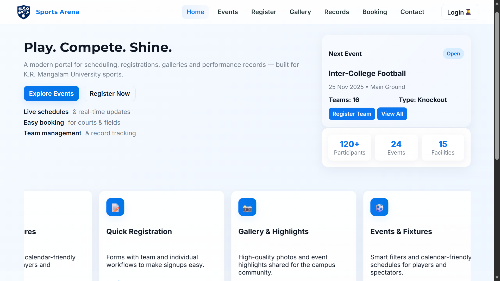
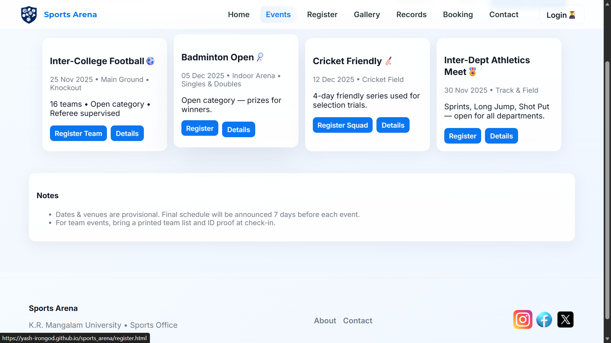
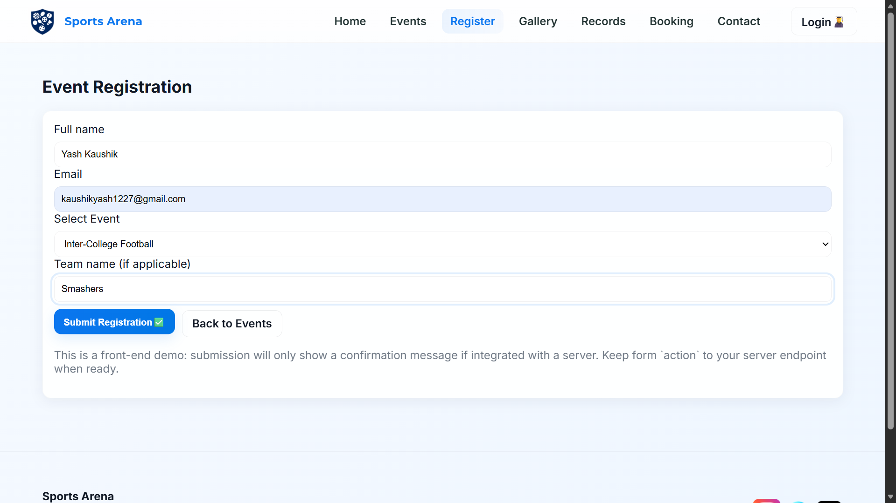
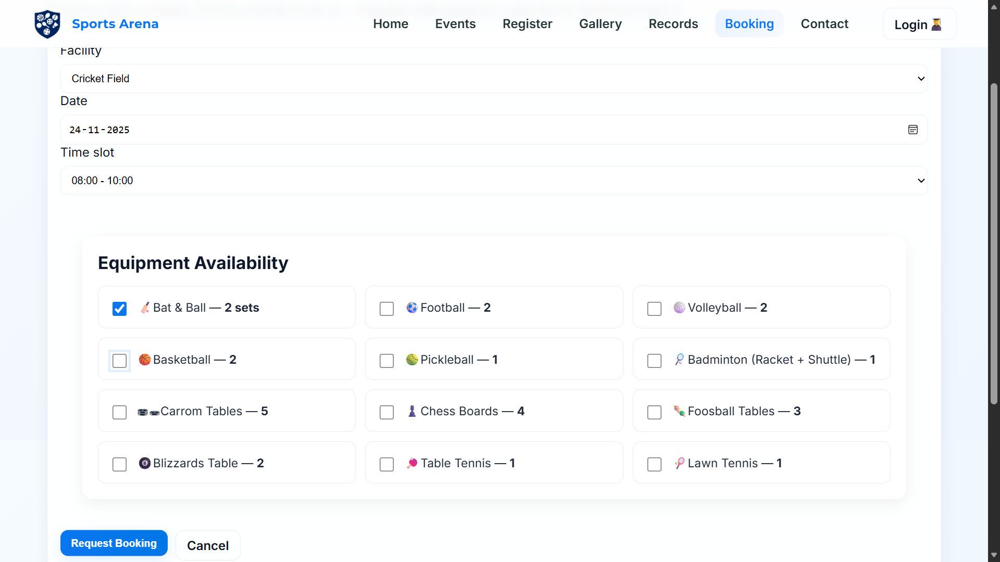
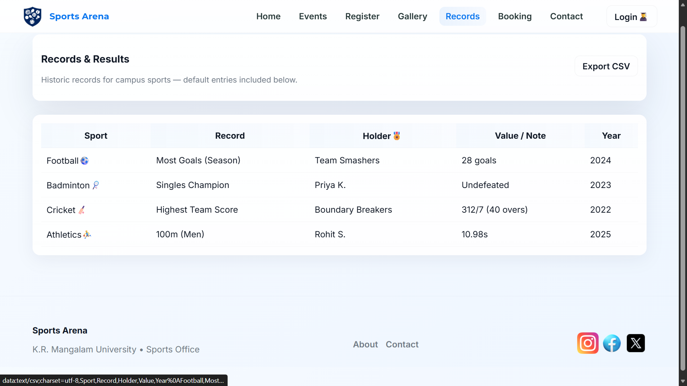
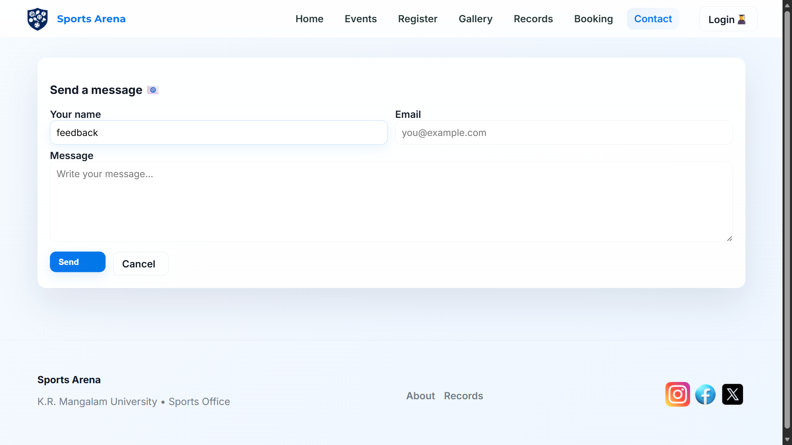
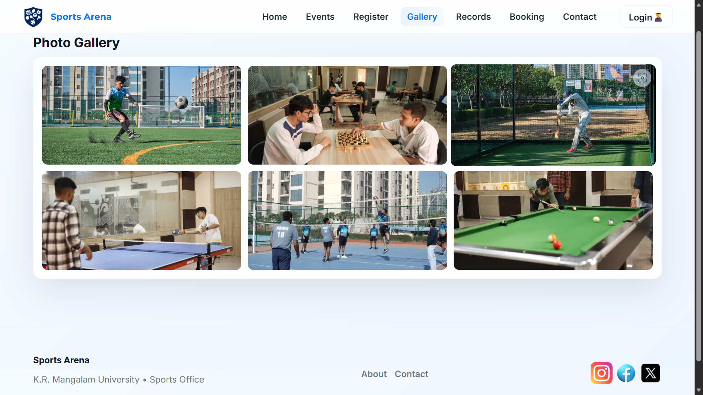
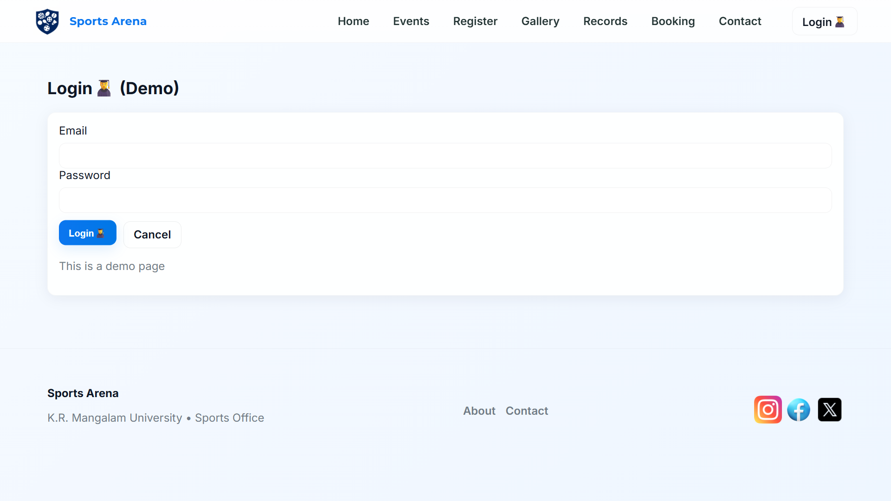

# Sports Arena – University Sports Management Portal

A modern and responsive web portal designed for K.R. Mangalam University Sports.
This platform serves as a central hub for events, registrations, facility booking,
galleries, and performance tracking.

## 🚀 Features

### 🏟️ Sports Management
- View all available sports offered by the university
- Explore training schedules and coaching details

### 📅 Events & Fixtures
- Check upcoming sports events
- View past event highlights and results

### 📝 Registrations
- Register teams and individuals for tournaments
- Submit forms for university sports trials

### 🏛️ Facility Booking
- Book courts, grounds, and sports rooms
- View availability timings

### 🖼️ Galleries
- Browse high-quality images from previous events

### 📊 Records & Results
- Track student achievements
- Maintain event-wise scoreboards

---

## 📂 Repository Structure

sports_arena/
│── index.html
│── about.html
│── sports.html
│── events.html
│── records.html
│── gallery.html
│── contact.html
│── styles.css
│── script.js
│── assets/
│     └── images/
│── docs/
│     ├── project_overview.md
│     ├── development_process.md
│     └── future_improvements.md
│── .gitignore
└── README.md

---

## 🛠️ Tech Stack

- HTML5
- CSS3
- JavaScript (Vanilla JS)
- Git & GitHub
- VS Code

---

## 📸 Screenshots

---

## 🧑‍💻 Getting Started

### 1. Clone the repository

### 2. Run locally
Open `index.html` in your browser.

---

## 📘 Documentation

Documentation is available inside the `docs/` folder:

- `project_overview.md` – explains the purpose and scope
- `development_process.md` – details how the project was built
- `future_improvements.md` – planned enhancements

---

## 🔧 Development Workflow (Assignment Requirements)

- ✔ Developed using VS Code
- ✔ Git used for version control
- ✔ Repository hosted on GitHub
- ✔ At least 5 meaningful commits included

---

## 🎯 Planned Improvements

- Convert to full-stack system (Node.js + MongoDB)
- Admin dashboard for managing events and results
- Student login & authentication
- Automated result publishing
- Improved mobile responsiveness

---

## © Author

**Yash**  
Sports Arena – University Sports Portal

